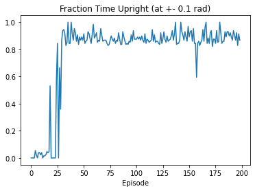

# DDPG-Pendulum

Implementation of a Deep Deterministic Policy Gradient (DDPG) algorithm to learn to stabilize a inverted pendulum.

The code is as simple as possible to be easily understandable and to be reused in more complex projects.
That is why I also removed the dependency on the gym libraries for simplicity and to have a self-contained code.

**Project overview**
---

**File Structure**
---
- The file `ddpg_main.py` contains
- The file `ddpg_networks.py` contains the code for the neural networks used by DDPG.
- The file `ddpg_utils.py`
- The file `pendulum_env.py` contains a simple, self-contained environment for the pendulum.

**Running**
---

Run `ddpg_main.py` to train the DDPG agent on the inverted pendulum.

**Results**
---

