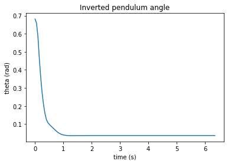
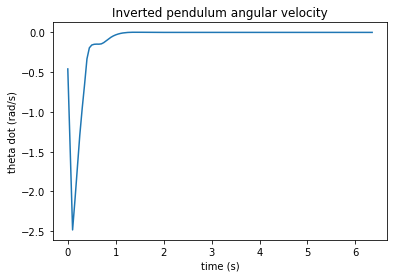
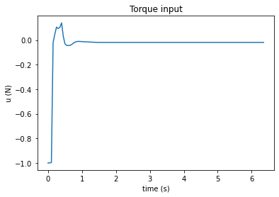

# DDPG-Pendulum

Implementation of a Deep Deterministic Policy Gradient (DDPG) algorithm to learn to stabilize a inverted pendulum.

The code is as simple as possible to be easily understandable and to be reused in more complex projects.
That is why I also removed the dependency on the gym libraries for simplicity and to have a self-contained code.

**Project overview**
---

**File Structure**
---
- The file `ddpg_main.py`
- The file `ddpg_utils.py`

**Running**
---

**Results**
---

